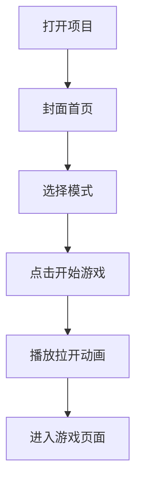

# 魔彩瓶封面首页与模式选择需求实现文档

## 1. 背景

当前魔彩瓶打开项目后会直接进入开屏或游戏流程，用户没有明确的首页停留区，也不能在进入游戏前选择简单 / 困难模式。

新的入口体验希望改成：

```text
打开项目 -> 展示封面首页 -> 选择模式 -> 点击开始游戏 -> 播放开屏拉开动画 -> 进入游戏页面
```

这样可以让项目更像一个完整小游戏，也能把“选择模式”和“开始游戏”的主动权交给用户。

## 2. 目标

- 打开项目后，第一屏展示封面，而不是直接进入游戏。
- 封面首页支持选择游戏模式。
- 用户点击“开始游戏”后，才播放开屏拉开动画。
- 动画结束后进入用户选择的模式。
- 封面页不提前开始计时、不提前播放音乐、不提前触发教学语音。
- 移动端第一屏要完整、稳定、好看，不需要用户刷新才能看到底部按钮。

## 3. 页面流程



## 4. 功能需求

### 4.1 封面首页

封面首页是项目打开后的默认页面。

页面内容：

- 全屏展示魔彩瓶封面图。
- 显示模式选择控件。
- 显示“开始游戏”按钮。
- 不展示游戏底部操作栏。
- 不展示游戏 Canvas 里的关卡状态。
- 不自动进入游戏。

移动端要求：

- 封面图铺满手机首屏。
- 不要外层边框。
- 不要出现明显白边、黑边或容器圆角。
- 主要视觉元素不能被按钮遮挡。
- 按钮区域建议放在屏幕下方 20% 到 28% 范围内。

PC 端要求：

- 可以使用手机比例容器居中展示。
- 外部背景保持浅色或和游戏背景一致。
- 封面图可以使用 PC 适配图或居中裁切图。

### 4.2 模式选择

第一版建议只在首页展示两种模式：

- 简单模式
- 困难模式

教学朗读、中文 / 英文 / 双语、幼宝模式 / 常规模式继续放在设置页中，避免首页信息过多。

交互规则：

- 默认选中“简单模式”。
- 如果本地缓存有上次选择的模式，可以默认选中上次模式。
- 用户点击模式按钮后，只更新当前封面页的待进入模式，不立刻进入游戏。
- 选中样式使用粉色按钮 + 白字。
- 未选中样式使用浅蓝按钮 + 蓝字。

### 4.3 开始游戏

点击“开始游戏”后：

- 将页面状态从 `cover` 切换为 `opening`。
- 播放开屏拉开动画。
- 动画播放过程中不允许重复点击开始。
- 动画结束后进入 `game` 状态。
- 根据封面页选择的模式初始化游戏。

### 4.4 开屏拉开动画

动画触发时机：

- 只在用户点击“开始游戏”之后触发。
- 刷新页面不会自动播放动画。

推荐视觉：

- 封面图分成左右两片。
- 左半边向左拉开。
- 右半边向右拉开。
- 背后露出游戏页面。
- 动画时间建议 700ms 到 1000ms。

动画结束后：

- 移除封面动画层。
- 进入 Canvas 游戏界面。

### 4.5 游戏页初始化

游戏页只在 `screen === "game"` 时初始化。

进入游戏后：

- 根据 `selectedMode` 设置当前模式。
- 从对应模式的第 1 关开始，或根据现有规则进入当前关。
- 游戏计时从进入游戏后开始。
- 背景音乐不自动播放。
- 音效和教学语音只在后续用户操作时触发。

### 4.6 音频策略

iOS Safari、微信浏览器、移动端 Chrome 对音频自动播放限制较多，因此入口音频规则要清晰。

建议：

- 点击“开始游戏”时可以同步执行一次音频解锁逻辑。
- 点击“开始游戏”不自动播放背景音乐。
- 背景音乐只在用户点击音乐按钮后播放。
- 不缓存“音乐开”状态，避免刷新后按钮显示开但实际没有声音。
- 可以缓存音量、教学语言、教学模式等不会触发自动播放的问题状态。

## 5. 状态设计

React 层新增页面阶段状态：

```ts
type ScreenState = "cover" | "opening" | "game";
type GameMode = "easy" | "hard";
```

推荐状态：

```ts
const [screen, setScreen] = useState<ScreenState>("cover");
const [selectedMode, setSelectedMode] = useState<GameMode>("easy");
```

状态含义：

| 状态 | 含义 |
|---|---|
| `cover` | 展示封面首页，用户可以选择模式 |
| `opening` | 播放开屏拉开动画 |
| `game` | 展示正式游戏页面 |

## 6. 推荐组件结构

建议在 React 层做页面流程控制，Canvas 只负责正式游戏。

```tsx
function MocaipingGame() {
  const [screen, setScreen] = useState<"cover" | "opening" | "game">("cover");
  const [selectedMode, setSelectedMode] = useState<"easy" | "hard">("easy");

  return (
    <div className="mocaiping-shell">
      {screen === "cover" && (
        <CoverScreen
          selectedMode={selectedMode}
          onSelectMode={setSelectedMode}
          onStart={() => setScreen("opening")}
        />
      )}

      {screen === "opening" && (
        <OpeningCurtain
          selectedMode={selectedMode}
          onDone={() => setScreen("game")}
        />
      )}

      {screen === "game" && (
        <GameCanvas initialMode={selectedMode} />
      )}
    </div>
  );
}
```

## 7. 具体实现方案

### 7.1 修改 `MocaipingGame.tsx`

目标文件：

```text
/Users/yinjun/Desktop/yjun-Datas/apps/yjun-color-water-sort-game/src/mocaiping/MocaipingGame.tsx
```

改造点：

- 新增 `screen` 状态。
- 新增 `selectedMode` 状态。
- 新增封面页 JSX。
- 新增开屏动画 JSX。
- 只有进入 `game` 状态后才挂载 Canvas 游戏容器。
- 初始化游戏时把 `selectedMode` 传给 `game.ts`。

### 7.2 修改 `game.ts`

目标文件：

```text
/Users/yinjun/Desktop/yjun-Datas/apps/yjun-color-water-sort-game/src/mocaiping/game.ts
```

建议给初始化函数增加配置参数：

```ts
initMocaipingGame(root, {
  initialMode: selectedMode
});
```

需要支持：

- 初始模式为 `easy` 或 `hard`。
- 初始化时使用传入的模式。
- 不在封面页提前创建游戏循环。
- 不在封面页提前播放音频。

如果当前 `initMocaipingGame` 已经返回销毁函数，要确保 React 切换页面时可以正确清理：

```ts
useEffect(() => {
  if (screen !== "game") return;

  const destroy = initMocaipingGame(rootRef.current, {
    initialMode: selectedMode
  });

  return destroy;
}, [screen, selectedMode]);
```

### 7.3 修改 `mocaiping.css`

目标文件：

```text
/Users/yinjun/Desktop/yjun-Datas/apps/yjun-color-water-sort-game/src/mocaiping/mocaiping.css
```

新增样式范围：

- `.cover-screen`
- `.cover-art`
- `.cover-controls`
- `.cover-mode-tabs`
- `.cover-mode-button`
- `.cover-start-button`
- `.opening-curtain`
- `.curtain-left`
- `.curtain-right`

### 7.4 封面页样式建议

```css
.cover-screen {
  position: fixed;
  inset: 0;
  overflow: hidden;
  background: #f7e8f2;
}

.cover-art {
  width: 100%;
  min-height: 100%;
  object-fit: cover;
  display: block;
}

.cover-controls {
  position: absolute;
  left: 50%;
  bottom: max(28px, env(safe-area-inset-bottom));
  width: min(88vw, 420px);
  transform: translateX(-50%);
  display: grid;
  gap: 14px;
}

.cover-mode-tabs {
  display: grid;
  grid-template-columns: 1fr 1fr;
  gap: 10px;
}

.cover-mode-button {
  height: 48px;
  border: 0;
  border-radius: 14px;
  background: #dff4ff;
  color: #117dad;
  font-weight: 900;
}

.cover-mode-button.is-active {
  background: #ff5fa1;
  color: #fff;
}

.cover-start-button {
  height: 56px;
  border: 0;
  border-radius: 16px;
  background: linear-gradient(180deg, #ff73ad, #f84d96);
  color: #fff;
  font-size: 20px;
  font-weight: 900;
  box-shadow: 0 8px 0 rgba(177, 55, 115, 0.28);
}
```

### 7.5 拉开动画样式建议

```css
.opening-curtain {
  position: fixed;
  inset: 0;
  z-index: 20;
  pointer-events: none;
  overflow: hidden;
}

.curtain-left,
.curtain-right {
  position: absolute;
  top: 0;
  width: 50%;
  height: 100%;
  background-image: url("/assets/mocaiping-cover-mobile.png");
  background-size: 200% 100%;
  background-repeat: no-repeat;
  animation-duration: 860ms;
  animation-timing-function: cubic-bezier(0.2, 0.8, 0.2, 1);
  animation-fill-mode: forwards;
}

.curtain-left {
  left: 0;
  background-position: left center;
  animation-name: curtainLeftOpen;
}

.curtain-right {
  right: 0;
  background-position: right center;
  animation-name: curtainRightOpen;
}

@keyframes curtainLeftOpen {
  to {
    transform: translateX(-102%);
  }
}

@keyframes curtainRightOpen {
  to {
    transform: translateX(102%);
  }
}
```

### 7.6 动画结束逻辑

可以用 `setTimeout` 控制：

```ts
useEffect(() => {
  if (screen !== "opening") return;

  const timer = window.setTimeout(() => {
    setScreen("game");
  }, 860);

  return () => window.clearTimeout(timer);
}, [screen]);
```

也可以监听 CSS 动画结束事件。第一版用 `setTimeout` 更简单稳定。

## 8. 本地缓存策略

建议缓存：

- 上次选择的模式：`mocaiping:selectedMode`
- 总音量
- 音乐音量
- 音效音量
- 教学语音音量
- 教学语言
- 教学类型
- 最佳成绩
- 困难模式解锁进度

不建议缓存：

- 背景音乐开启状态

原因：

- 移动端刷新页面后不能自动播放音乐。
- 如果缓存“音乐开”，用户看到按钮是开，但实际没声音，容易误判为 bug。

## 9. 验收标准

### 9.1 基础流程

- 打开项目后默认展示封面首页。
- 封面首页不显示游戏操作栏。
- 封面首页不开始游戏计时。
- 封面首页不自动播放背景音乐。
- 可以在封面页选择简单模式。
- 可以在封面页选择困难模式。
- 点击“开始游戏”后播放拉开动画。
- 动画结束后进入对应模式游戏页。

### 9.2 移动端适配

- iPhone 竖屏打开，封面图完整铺满第一屏。
- 底部“开始游戏”按钮不被 Safari / Chrome 底栏遮挡。
- 不需要刷新页面才能看到底部按钮。
- 横向不出现异常滚动。
- 不出现明显白边、黑边、边框或圆角。

### 9.3 游戏状态

- 选择简单模式后进入简单模式关卡。
- 选择困难模式后进入困难模式关卡。
- 进入游戏后撤销、提示、重开、设置等原功能仍正常。
- 游戏完成后自动跳转下一关逻辑不受影响。

### 9.4 音频

- 点击开始游戏不会自动播放背景音乐。
- 点击音乐按钮后才播放背景音乐。
- 倒水音效仍只在倒水时播放。
- 教学语音仍只在教学模式开启后，按操作触发。

### 9.5 构建验证

开发完成后至少运行：

```bash
cd /Users/yinjun/Desktop/yjun-Datas/apps/yjun-color-water-sort-game
rtk pnpm lint
rtk pnpm typecheck
rtk pnpm build
```

如果涉及移动端视觉调整，还需要用本地服务验证：

```bash
rtk pnpm dev --host 0.0.0.0 --port 5201
```

然后测试：

```text
http://localhost:5201/
```

## 10. 预估改动范围

| 文件 | 改动 |
|---|---|
| `src/mocaiping/MocaipingGame.tsx` | 新增封面首页、模式选择、页面阶段控制 |
| `src/mocaiping/mocaiping.css` | 新增封面页、模式按钮、开始按钮、拉开动画样式 |
| `src/mocaiping/game.ts` | 支持初始模式参数，避免封面阶段提前初始化游戏 |
| `public/assets/` | 复用现有封面图，必要时增加 PC / Mobile 两版封面 |

## 11. 实施顺序

1. 先在 `MocaipingGame.tsx` 增加 `cover / opening / game` 三阶段状态。
2. 新增封面首页 UI，先用现有封面图和简单按钮跑通流程。
3. 改造 `game.ts`，支持传入 `initialMode`。
4. 接入“简单 / 困难”选择。
5. 新增拉开动画。
6. 做移动端首屏适配。
7. 检查音频逻辑，确保不会打开页面就播放音乐。
8. 跑 lint、typecheck、build。
9. 手机端实际验证 Safari / Chrome / 微信浏览器。

## 12. 风险与注意事项

- 不要让 Canvas 游戏在封面页提前初始化，否则可能提前占用音频、计时器和动画循环。
- 不要缓存“音乐开”，否则刷新后移动端无法自动播放，会造成按钮状态和真实声音不一致。
- 拉开动画使用封面图时，要注意生产环境 GitHub Pages 的资源路径，避免 `/assets/...` 在子路径部署时失效。
- 移动端底部按钮需要考虑 `safe-area-inset-bottom`。
- PC 和手机封面图比例不同，如果一张图无法兼顾，建议准备 mobile 和 desktop 两张。

## 13. 推荐第一版范围

第一版先做：

- 封面首页。
- 简单 / 困难模式选择。
- 开始游戏按钮。
- 点击开始后播放拉开动画。
- 进入对应模式游戏。

暂不做：

- 首页教学模式开关。
- 首页音量设置。
- 首页关卡选择。
- 首页排行榜或成就。

原因：

- 首页越干净，越像正式小游戏。
- 教学和声音设置已经在设置页里有入口。
- 第一版重点是把进入流程做顺、做稳、做好看。
